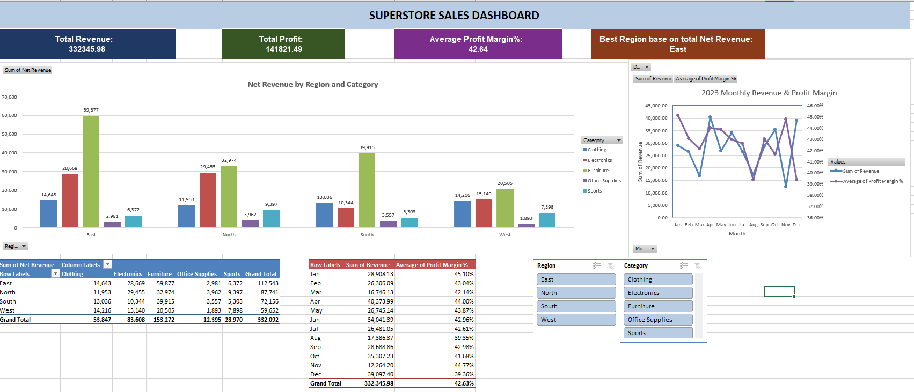
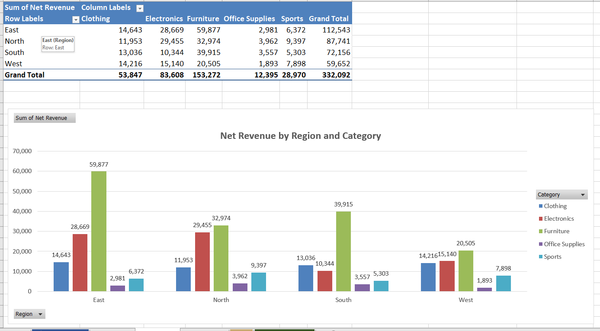
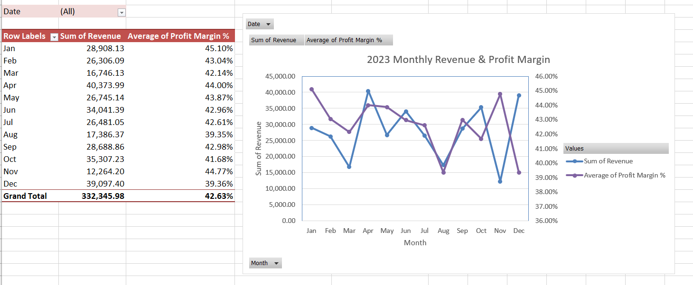
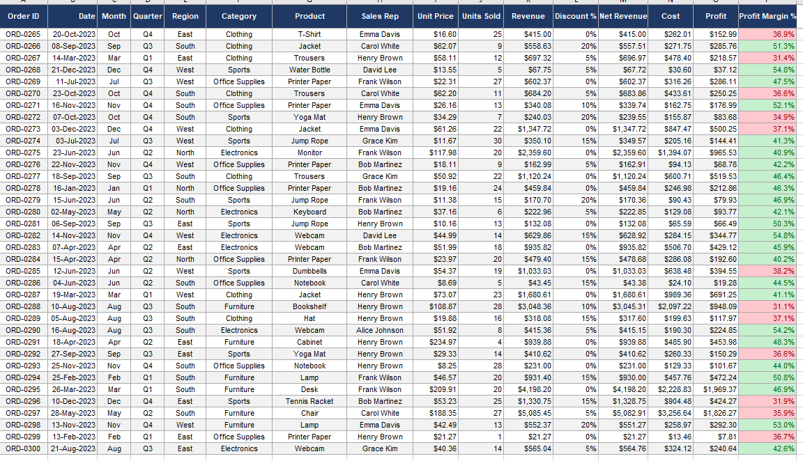

#  Superstore Sales Analysis — Excel Project

A hands-on Excel project built to practice and evaluate intermediate Excel skills using a realistic business sales dataset.

---

##  Project Structure

```
├── superstore_sales_project.xlsx   # Main Excel workbook
├── screenshots/
│   ├── dashboard.png               # KPI Dashboard overview
│   ├── pivot_region.png            # PivotTable – Revenue by Region & Category
│   ├── pivot_monthly.png           # PivotTable – Monthly Trend
│   └── raw_data.png                # Raw dataset preview
└── README.md
```

---

##  Dataset Overview

| Detail | Info |
|---|---|
| Total Orders | 300 |
| Year | 2023 |
| Regions | North, South, East, West |
| Categories | Electronics, Furniture, Office Supplies, Clothing, Sports |
| Sales Reps | 8 |
| Columns | 16 (Order ID, Date, Region, Category, Product, Revenue, Profit, etc.) |

---

##  What I Built

### 1. Data Cleaning & Formatting
- Formatted date column to `DD-MMM-YYYY`
- Applied currency formatting to Revenue, Cost, and Profit columns
- Added conditional formatting — Profit Margin % highlights red if below 40%, green if above 40%

### 2. Named Ranges
- Created named ranges for the full dataset, Revenue column, and Region column for cleaner formulas

### 3. Formulas
- `SUM` — Total Revenue across all orders
- `AVERAGE` — Average Profit Margin %
- `MAX` — Highest single-order Revenue
- `COUNTIF` — Number of orders with a discount applied
- `SUMIF` — Total Revenue filtered by product category

### 4. VLOOKUP / XLOOKUP
- Built a dynamic order lookup tool — input any Order ID and it returns the Sales Rep, Product, and Net Revenue automatically
- Added data validation on the input cell

### 5. PivotTables
- **Region × Category** — Net Revenue broken down by all 4 regions and 5 categories with Grand Totals
- **Monthly Trend** — Revenue, Profit, and Avg Profit Margin % across Jan–Dec with a calculated field for Average Order Value

### 6. Charts
- **Clustered Bar Chart** — Net Revenue by Region & Category
- **Dual-Axis Line Chart** — Monthly Revenue (left axis) vs. Profit Margin % (right axis)

### 7. KPI Dashboard
- 4 KPI tiles showing Total Revenue, Total Profit, Avg Profit Margin %, and Best-Performing Region
- Best Region calculated using `INDEX/MATCH`

### 8. Slicers
- Added Region and Category slicers
- Connected the Category slicer to both PivotTables simultaneously

---

##  Skills Practiced

`PivotTables` `VLOOKUP` `XLOOKUP` `SUMIF` `COUNTIF` `INDEX/MATCH` `Conditional Formatting` `Data Validation` `Charts` `Slicers` `Named Ranges` `Dashboard Design`

---

##  Screenshots

### Dashboard


### Revenue by Region & Category


### Monthly Revenue & Profit Margin Trend


### Raw Data


---

##  What I Learned

This Excel project was more challenging than I expected. A few things that stood out:

- Clean data matters more than anything — I ran into a date format issue early on that took a while to debug before I could start any analysis
- PivotTables are incredibly powerful once you understand how rows, columns, and values interact
- Building a dashboard forces you to think about what actually matters in the data, not just what you can calculate

---

## Author
Made by Rui Manalo · [LinkedIn](https://www.linkedin.com/in/rui-manalo-71350a376), [Portfolio](https://www.datascienceportfol.io/ruicourse3)


